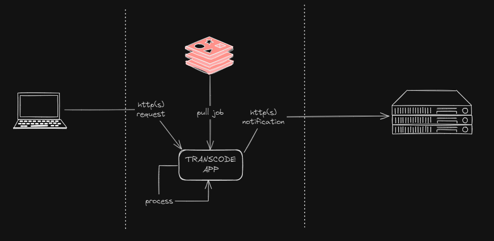

# Transcoder


Transcode videos to HLS and / or DASH adaptative bitrate streaming protocols. Also includes optional notifications for status updates

Some post-events could be configured. Take a look at [environment variables](#environment-variables)



* [Requirements](#requirements)
* [Install and run](#install-and-run)
    * [Locally](#locally)
    * [Docker Compose](#docker-compose)
* [Documentation](#documentation)
    * [API Swagger](#api-swagger)
    * [Environment variables](#environment-variables)
* [How to use](#how-to-use)
    * [HTTP](#http)
    * [REDIS](#redis)
* [FAQ](#faq)
* [LICENSE](#license)
* [Support and PR](#support-and-pr)

## Requirements
| Tech       	| Version  	   | Mandatory  
|------------	|--------------|--------------|
| NodeJS     	| v20.11.0 	   | YES
| NPM        	| 10.5.2   	   | YES
| Redis         | 7.4.0-alpine | NO but strongly recommended

## Install and run
### Locally
```sh
# install dependencies
npm i

# create a .env file
# there is a .env.sample file in root

# run it
npm run dev
```
> .vscode folder is attached to the project in case debuging is needed

### Docker Compose
```sh
# build and run
docker compose -f docker-compose.yml up -d

# REDIS ONLY
docker compose -f docker-compose-redis.yml up -d
```

## Documentation
### API Swagger
It could be checked here: http://localhost:3002/documentation

## Environment Variables
Due to a correct local functioning, add a .env file to the root with the following values filled.

> A `.env.sample` is in the repo as example

## How to use

### HTTP
| METHOD      | PATH 	        
|-------------|---------------
| __POST__      	| _/transcoder_ 


| PAYLOAD           | DEFAULT          | REQUIRED | DESCRIPTION
|-------------------|------------------|----------|-------------
| trackingId        |                  | false    | Unique identifier for tracking the transcoding job
| inputFilePath     |./volumes/cbd.mp4 | true     | Path to the source video file
| hlsOutputPath     |./volumes/hls/cbd | false*   | Output directory for HLS files
| dashOutputPath    |./volumes/dash/cbd| false*   | Output directory for DASH files
| encryptionKeyPath |                  | false    | Path to encryption key file for HLS encryption
| encryptionKeyUrl  |                  | false    | URL where the encryption key will be accessible

* _hlsOutputPath_ and _dashOutputPath_ are optional, but at least one is mandatory
* _encryptionKeyPath_ and _encryptionKeyUrl_ are both required together for HLS encryption (optional feature)

> For more info, once the app is running, check documentation: http://localhost:3002/documentation

#### Basic Example: 
```sh
# Basic transcoding without encryption
curl --location 'localhost:3002/transcoder' \
--header 'Content-Type: application/json' \
--data '{
    "trackingId": "aaaaaaaa-cccc-dddd-aaaa-bbbbbbbbbbbb",
    "inputFilePath": "./volumes/cbd.mp4",
    "hlsOutputPath": "./volumes/hls/cbd",
    "dashOutputPath": "./volumes/dash/cbd"
}'
```

#### HLS Encryption Example:
```sh
# HLS transcoding with AES-128 encryption
curl --location 'localhost:3002/transcoder' \
--header 'Content-Type: application/json' \
--data '{
    "trackingId": "aaaaaaaa-cccc-dddd-aaaa-bbbbbbbbbbbb",
    "inputFilePath": "./volumes/cbd.mp4",
    "hlsOutputPath": "./volumes/hls/cbd",
    "encryptionKeyPath": "./volumes/keys/encryption.key",
    "encryptionKeyUrl": "https://your-domain.com/keys/encryption.key"
}'
```

> **Note on HLS Encryption**: When using HLS encryption, ensure your encryption key file exists at the specified path and will be accessible via the provided URL. The transcoder uses AES-128 encryption and automatically generates a key info file for ffmpeg.

### REDIS
A Redis consumer is listening to published jobs in _transcoder_jobs_queue_ queue, the defined in the environment variable __REDIS_TRANSCODER_MAIN_QUEUE__.

The job MUST have the same structure as the HTTP payload, and stringified.

There is a dead letter queue named _transcoder_jobs_dead_letter_queue_ or if overwritten with __REDIS_TRANSCODER_DEAD_LETTER_QUEUE__ environment variable, for all those jobs that can't be processed for any reason. They are pushed to the queue with the following format:
```sh
{
    datePushed: '2024-10-07T09:02:14.179Z',
    job: {},
    message: \"Unexpected token 'h', \"whatever\" is not valid JSON",
}
```

#### Useful commands for Redis-cli:
```sh
# list queue jobs
LRANGE transcoder_jobs_queue 0 -1

# push job into queue
LPUSH transcoder_jobs_queue "{\r\n    \"inputFilePath\": \"./volumes/whatever.mp4\",\r\n    \"hlsOutputPath\": \"./volumes/hls/whatever\"\r\n}"
```

## FAQ
__Q: Is it ready for scaling?__

__A:__ Yes. However, it is strongly recommended to use the Redis approach.

__Q: Is it possible to run just one job for HLS or DASH and not both together?__

__A:__ Yes. In the payload, include the key you want to trigger, _hlsOutputPath_ or _dashOutputPath_. Including both keys in the same payload is also allowed.

__Q: Is it possible to use Redis queues for status changes instead of HTTP(S)?__

__A:__ No. Currently, HTTP(S) notifications are the only way for updating status.

__Q: Can I decide which change events I want to send a HTTP(S) notification?__

__A:__ Yes. Take a look at the _NOTIFICATION_WEBHOOK_ON_ [environment variables](#environment-variables).

__Q: Can I track the request in some way?__

__A:__ Yes. Adding a trackingId attribute to the payload request. It'll be returned on every notification hook event.

__Q: Does the transcoder support HLS encryption?__

__A:__ Yes. The transcoder supports AES-128 HLS encryption. To enable encryption, include both `encryptionKeyPath` (path to your encryption key file) and `encryptionKeyUrl` (URL where the key will be accessible) in your request payload. The transcoder automatically creates the required key info file and configures ffmpeg for encrypted HLS output.


## LICENSE
Check [License](./LICENSE) file


## Support and PR
Feel free to ask for support, or pull requests with improvements this repository. I will be very happy to hear from you, and make this as useful as possible